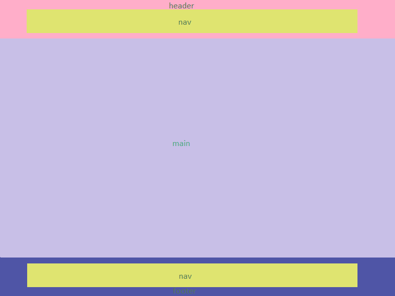
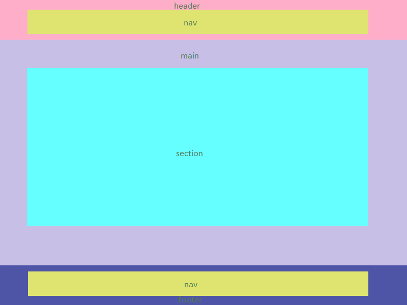
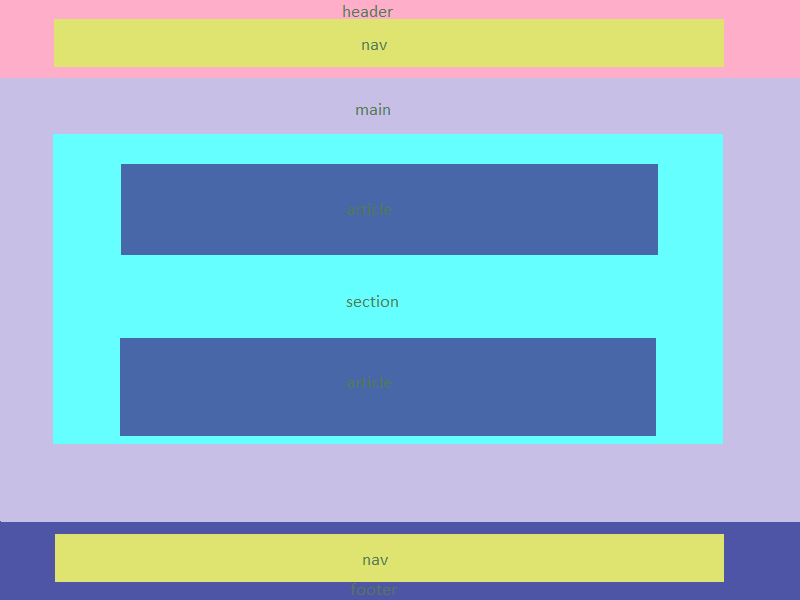
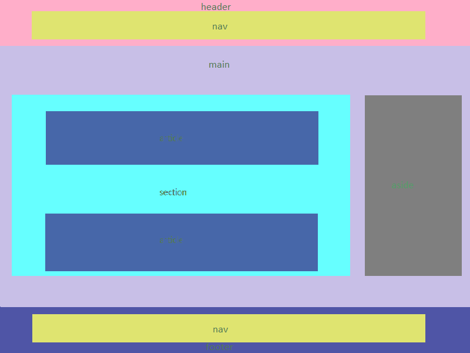

If you want to write semantic markup — and believe us, you do want to write semantic markup — then you need to structure HTML documents properly. The html, head and body elements have been part of the HTML specification since the mid 1990s, and up until a few years ago they were the primary elements used to give structure to HTML documents. However, the situation has changed dramatically in the last few years as **HTML5** has added a slew of new tags that can be used to add rich **semantic** meaning to the structure of an HTML document.

Up until HTML5, that was pretty much it for basic HTML document structure. All of our code was dropped in between the body tags and styled with CSS. However, now that HTML5 has broad support among modern browsers, it’s time to implement the new HTML5 tags that will give our HTML documents a much more meaningful structure.

We can start with a basic body structure of html page with a header, main and footer. Later we can add other semantic elements to all of these elements.

The header element is used to contain the content that appears at the top of every page of your website. Main element is used between header and footer elements to contain the primary content of your web page. The footer appears at the bottom of a section of a document. Typically, the footer is a direct descendant of the body element.

Header may contain : the logo, tagline, search prompt, and possibly a navigational menu. In most cases, the header element is best positioned as a direct descendant of the body element, but it’s also ok to place it inside the main element if you prefer.

Typically, the footer is a direct descendant of the body element, but it can also be used within a main element, a section, or an article. The most common use of the footer element is to place it at the bottom of an HTML document to contain things like a copyright notice, links to related content, and links to administrative things like privacy policies and website’s terms of service.

For example, if article tags have been used to wrap a forum post, it would be appropriate to wrap copyright information and the date and time the post was made in a footer element and place it at the bottom of the article.

The section element is used to identify content that is a major sub-section of a larger whole. For example, if you’ve posted a long document in HTML format, it would be reasonable to wrap each chapter in a section element. There might me some confusion in usage of section and div. So to clear that you should remember two things:

1.  Use 
 when you are wrapping up some content purely to make it easier to style the content.
2.  Use <section> when you want to list the content as an item when writing out an outline of the document.

If your web-page includes blog posts, articles, or any other content that could just as well appear on another website as syndicated content, wrap that content in an article post. You can use an article element just about anywhere other than nested within a main element, but in most cases an article element will be a direct descendant of a main element or of a section element that is a direct descendant of a main element.

If your website contains information that isn’t directly related to the main content of the page, it would be appropriate to wrap that information in aside tags. For example, if you write a post that includes some technical terms, and you add definitions for those terms in a sidebar, it would make sense to wrap those definitions in aside tags.

We can use multiple instances of any element we need, but usually we keep just one header and one footer and other elements are dependent solely on the requirements.
