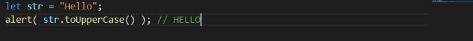

There are many things one would want to do with a primitive like a string or a number. It would be great to access them as methods. Along with that primitives must be as fast and lightweight as possible.

The solution looks a little bit awkward, but here it is:

1.  Primitives are still primitive. A single value, as desired.
2.  The language allows access to methods and properties of strings, numbers, booleans and symbols.
3.  In order for that to work, a special “object wrapper” that provides the extra functionality is created, and then is destroyed.

The `object wrappers` are different for each primitive type and are called: `**String**`, `**Number**`, `**Boolean**` and `**Symbol**`. Thus, they provide different sets of methods.

For instance, there exists a string method [str.toUpperCase()](https://developer.mozilla.org/en/docs/Web/JavaScript/Reference/Global_Objects/String/toUpperCase) that returns a capitalized `str`.

Simple, right? Here’s what actually happens in `**str.toUpperCase()**`:

1.  The string `**str**` is a primitive. So in the moment of accessing its property, a special object is created that knows the value of the string, and has useful methods, like `**toUpperCase()**`.
2.  That method runs and returns a new string (shown by `**alert**`).
3.  The special object is destroyed, leaving the primitive `**str**` alone.

So primitives can provide methods, but they still remain lightweight. The JavaScript engine highly optimizes this process. It may even skip the creation of the extra object at all. But it must still adhere to the specification and behave as if it creates one.

When we treat a primitive value like it was an object (i.e. by accessing properties and methods), JavaScript creates, under the hood, a wrapper to wrap this value and expose it as an object. The JS engine never reuses a wrapper object, giving them to the garbage collector right after a single use. if you run `console.log(str.toUpperCase())`, JavaScript will create a brand new wrapper object to wrap the primitive value stored in the `surname` variable, expose its properties and utility methods (e.g. `toUpperCase`) and finally dispose it once again.

We’ll see more specific methods in next articles.
